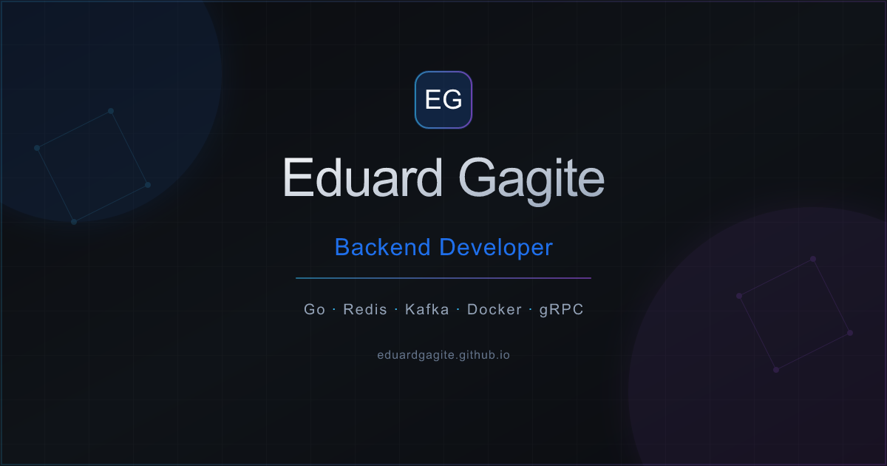

<div align="center">
  

# eduardgagite.github.io

Личный сайт и заметки о backend-разработке.

[Сайт](https://eduardgagite.github.io) ·
[Перейти к материалам](https://eduardgagite.github.io/materials?lang=ru)

[](https://github.com/eduardgagite/eduardgagite.github.io/actions/workflows/deploy.yml)
</div>

## О проекте

Это исходники моего личного сайта. Изначально здесь была только страница с коротким рассказом обо мне и контактами. Позже я добавил раздел с конспектами, которые собирал во время работы и учёбы.

Сейчас на сайте 167 материалов:

- Go: основы, конкурентность, API, тестирование;
- Redis: структуры данных, практические паттерны, Streams и кластеры;
- Docker: образы, Compose, сети и разбор частых проблем.

Это не последовательный учебный курс. Скорее справочник, к которому можно вернуться, когда нужно быстро освежить тему или посмотреть пример.

В разделе материалов есть поиск, фильтры, оглавление и навигация между статьями. Код и ссылки можно копировать одной кнопкой. Последняя открытая статья сохраняется в браузере.

## Стек

- React 18, TypeScript и Vite
- Tailwind CSS
- React Router
- i18next
- React Markdown и Prism
- Playwright для браузерных тестов

Backend и база данных сайту не нужны. Контент собирается заранее и публикуется на GitHub Pages как статические файлы.

## Запуск локально

Понадобятся [Node.js](https://nodejs.org/) версии **20.19 или новее** и npm.

```bash
git clone https://github.com/eduardgagite/eduardgagite.github.io.git
cd eduardgagite.github.io
npm ci
npm run dev
```

Адрес локального сервера появится в терминале. Индекс материалов, sitemap и остальные сгенерированные файлы обновятся перед запуском Vite.

Для обычной разработки Playwright не нужен. Chromium понадобится только для e2e-тестов:

```bash
npx playwright install chromium
npm run build
npm run test:e2e
```

## Команды

| Команда            | Назначение                                     |
| ------------------ | ---------------------------------------------- |
| `npm run dev`      | Генерация данных и dev-сервер                  |
| `npm run build`    | Production-сборка в `dist/`                    |
| `npm run preview`  | Локальный просмотр сборки на порту `5173`      |
| `npm run check`    | TypeScript, ESLint, Prettier и модульные тесты |
| `npm run test`     | Модульные тесты                                |
| `npm run test:e2e` | Smoke-тесты в Chromium                         |
| `npm run format`   | Форматирование                                 |

## Структура

```text
content/materials/       Исходники материалов в Markdown
scripts/                 Генераторы контента, sitemap и HTML
src/components/          Общие компоненты
src/features/materials/  Раздел с материалами
src/i18n/                Переводы интерфейса
src/pages/               Страницы сайта
e2e/                     Браузерные тесты
public/                  Статика и сгенерированные файлы
```

Исходником каждой статьи служит Markdown-файл. Перед сборкой скрипты проверяют frontmatter, создают JSON для приложения и обновляют sitemap. После сборки для маршрутов материалов создаются отдельные HTML-файлы с метаданными. Это нужно, чтобы прямые ссылки нормально индексировались, хотя сам сайт работает как SPA.

## Добавление материала

Новый материал нужно положить сюда:

```text
content/materials/<category>/<section>/<slug>.ru.md
```

В начале файла должен быть frontmatter:

```yaml
---
title: 'Название материала'
category: 'golang'
categoryTitle: 'Go'
section: 'intro'
sectionTitle: 'Введение'
sectionOrder: 1
order: 1
---
```

Поля `subtitle`, `datePublished`, `dateModified`, `level` и `tags` необязательные. Картинки можно хранить рядом со статьёй в папке `images/`.

После правок:

```bash
npm run build
npm run check
```

Сгенерированные JSON-файлы и sitemap коммитятся в репозиторий. GitHub Pages раздаёт их вместе с остальной статикой.

## Языки и публикация

Интерфейс переведён на русский и английский. Выбранный язык хранится в параметре `?lang=ru|en` и запоминается браузером. Сами статьи пока есть только на русском.

Workflow в `.github/workflows/deploy.yml` проверяет код, собирает проект и запускает smoke-тесты. Pull request заканчивается на проверках. Push в `main` после них публикуется на GitHub Pages.

## Контакты

[GitHub](https://github.com/eduardgagite) ·
[Telegram](https://t.me/edublago) ·
[Email](mailto:eduardgagite@gmail.com)
